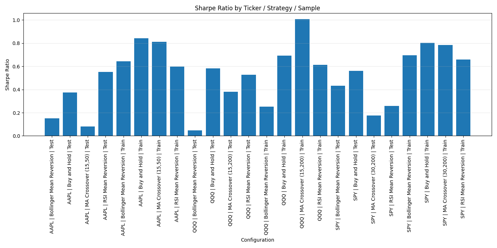
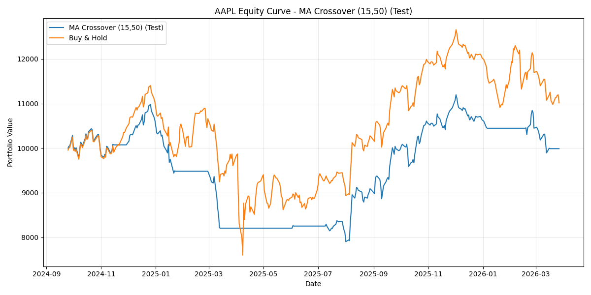
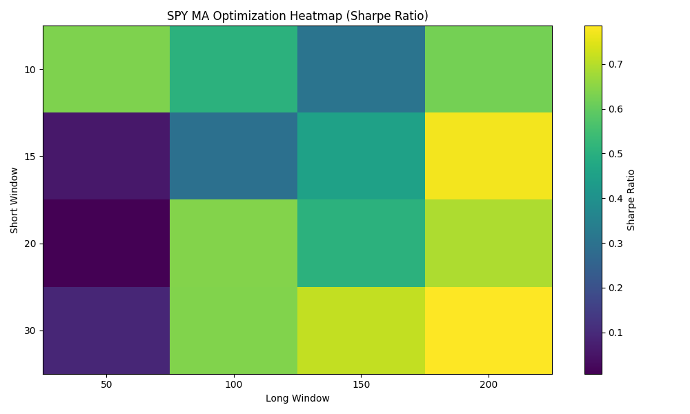

# Quantitative Trading Strategy Backtester & Cross-Asset Generalization Study

Finalized implementation including:
- Multi-strategy backtesting (MA, RSI, Bollinger Bands)
- Train/test evaluation framework
- Cross-asset generalization research pipeline
- Performance metrics (Sharpe, Sortino, drawdown, etc.)
- Visualization outputs (equity curves, heatmaps)

## Overview
This project implements a quantitative trading research pipeline for evaluating systematic trading strategies on historical daily equity and ETF data.

It includes:
- Multiple assets: SPY, QQQ, AAPL
- Multiple strategies:
  - Moving Average Crossover
  - RSI Mean Reversion
  - Bollinger Mean Reversion
  - Buy and Hold benchmark
- Train/Test split for out-of-sample evaluation
- Parameter optimization for moving-average windows
- Risk-adjusted performance metrics
- Automated result and plot generation

---

## Data
The project uses daily historical OHLCV data from Yahoo Finance.

Current tested assets:
- **SPY**: S&P 500 ETF proxy
- **QQQ**: Nasdaq-100 ETF proxy
- **AAPL**: individual equity

This project currently evaluates **daily stock/ETF data**, not futures or options.

---

## Strategies

### 1. Moving Average Crossover
- Long when short SMA > long SMA
- Exit when short SMA <= long SMA
- Parameters optimized using grid search on the training set

### 2. RSI Mean Reversion
- Enter when RSI < 30
- Exit when RSI > 55

### 3. Bollinger Mean Reversion
- Enter when price falls below the lower Bollinger Band
- Exit when price reverts above the rolling mean

### 4. Buy and Hold
- Benchmark strategy with continuous exposure

---

## Methodology

### Train/Test Split
- 70% training sample
- 30% test sample
- MA parameters optimized on training data only
- Performance evaluated both in-sample and out-of-sample

### Optimization
The moving-average strategy is optimized across multiple short/long window combinations using Sharpe ratio as the objective.

### Metrics
Performance is evaluated using:
- Total Return
- Annualized Return
- Annualized Volatility
- Downside Volatility
- Sharpe Ratio
- Sortino Ratio
- Max Drawdown
- Calmar Ratio

Trade-level metrics:
- Number of Trades
- Win Rate
- Average Trade Return
- Best/Worst Trade Return
- Average Holding Days

Note: trade-level statistics for Buy and Hold are less informative than for active strategies because the benchmark maintains continuous exposure.

---

## Configurability
The backtest window is configurable using a rolling lookback period, and the end date automatically updates to the current date at runtime.

---

## Example Visuals

### Strategy Comparison

### Example Equity Curve

### MA Optimization Heatmap

---

## Output Files
The project generates:
- cleaned summary metrics
- raw summary metrics
- parameter optimization tables
- daily backtest result CSVs
- trade logs
- plots for signals, equity curves, drawdowns, and optimization

Main outputs:
- `results/summary_metrics_clean.csv`
- `results/summary_metrics_raw.csv`
- `results/<TICKER>_ma_optimization.csv`
- `plots/strategy_comparison_sharpe.png`

---

## Tech Stack
- Python
- pandas
- numpy
- matplotlib
- yfinance

---

## Potential Future Improvements
- additional strategies
- portfolio-level backtesting
- walk-forward optimization
- transaction cost sensitivity analysis
- intraday/futures-specific extensions